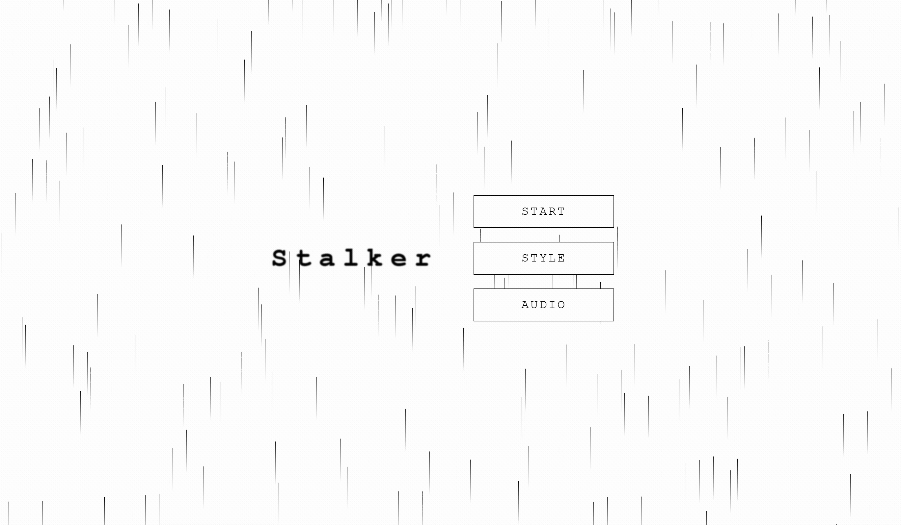
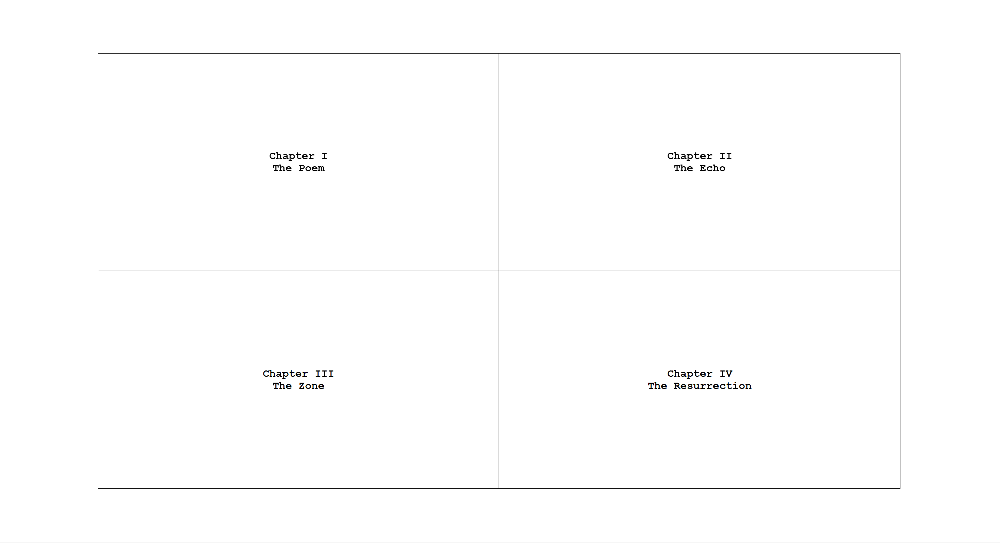
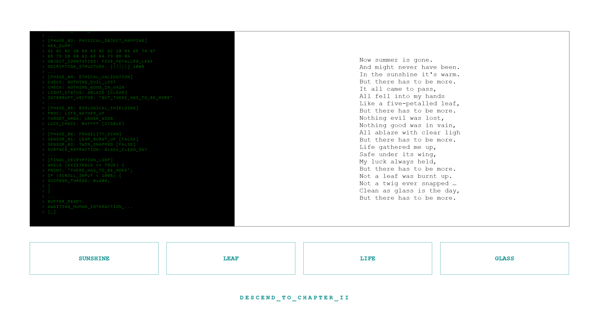
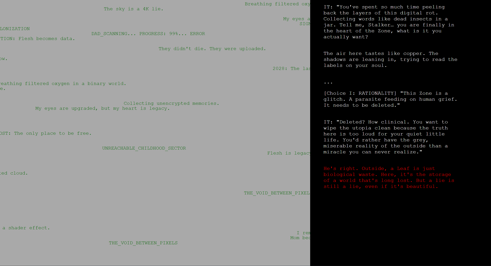

# [ STALKER ]

A Project by: Yukuan Ge

---

An interactive journey that explores the ruins of time and fragmented memories from an era before the digital revolution.

*Beginning of the adventure*

### Introduction
Stalker is an interactive website adapting the original film Stalker (1979), dir. Andrei Tarkovsky. Instead of placing the story during the Soviet era, Stalker the web is set in a digital era where reality is a long-lost history. Through scrolling, filling out missing words and making choices, the traveller explores the truth behind the half-remembered lives of the Zone.

### Abstract

*Four chapters of this website*

The entire project was inspired by the haunting and mysterious atmosphere of Tarkovsky’s Stalker and the concept of "digital colonization". There are four chapters throughout the entire journey (The Poem, The Echo, The Zone, The Resurrection) and each chapter represents an entirely different experience. Throughout the journey, users will solve puzzles, crack codes, and even debate with their inner selves.

*Chapter One*

*Chapter Three*

The website holds a minimalist aesthetic, and in some particular parts simulates an old-world computer hardware-like experience. The users are also explorers (aka stalkers) They are digital scavengers hunting for the friction of cotton and the taste of real rain in a world made of pixels.

